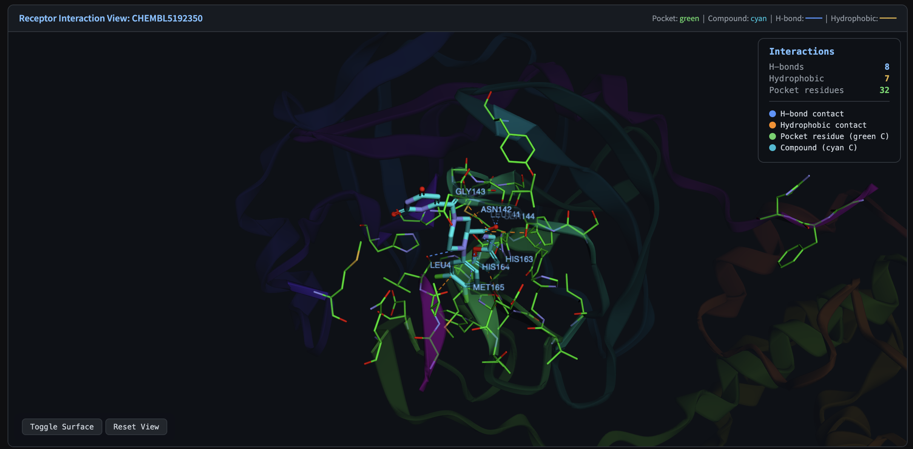
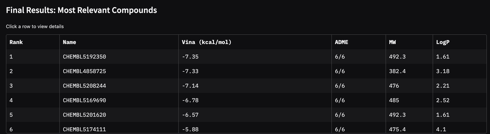
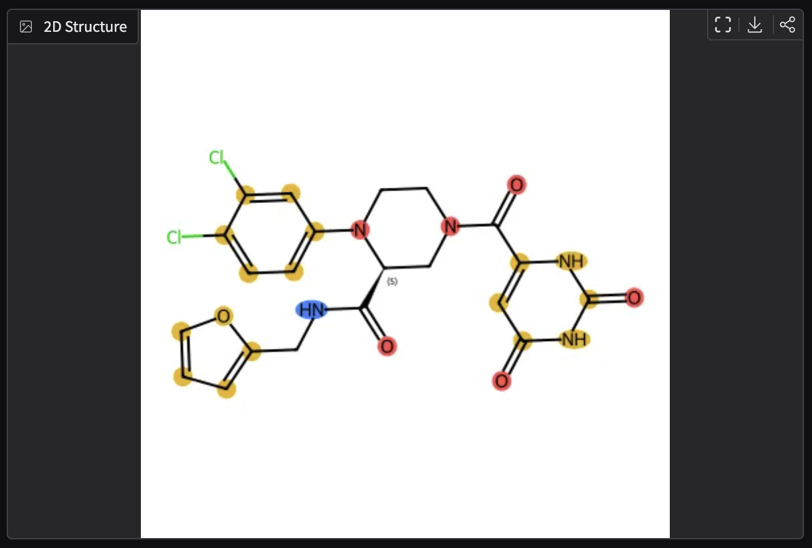
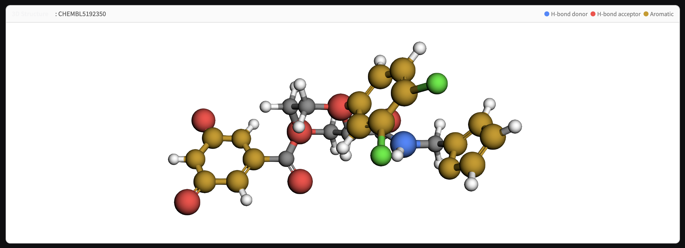
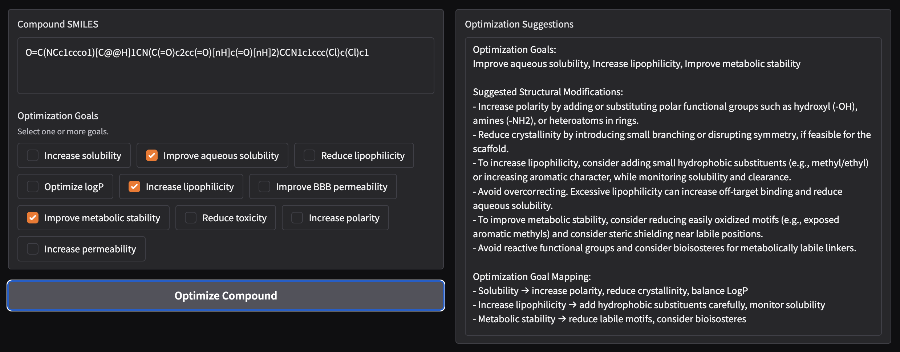

<p align="center">
  
  
  
  
  
</p>

# AI4DrugDesign

**An end-to-end computational drug discovery pipeline.** Enter a protein target, and the system autonomously discovers, filters, docks, and ranks drug candidates -- from a PDB ID to optimized lead compounds in a single session.

<p align="center">
  
</p>

---

### Key Features

The pipeline outputs a ranked table of drug candidates sorted by Vina binding affinity, with ADME scores, molecular weight, and LogP at a glance. Click any compound row to get detailed analysis.

<p align="center">
  
</p>

### 2D Structure with Pharmacophore Highlighting

Each compound is rendered with color-coded pharmacophore features -- **blue** for H-bond donors, **red** for H-bond acceptors, **gold** for aromatic systems.

<p align="center">
  
</p>

### 3D Compound Viewer

Interactive 3Dmol.js viewer with the same pharmacophore color scheme in three dimensions. Rotate, zoom, and inspect the molecular geometry.

<p align="center">
  
</p>

### Receptor-Ligand Interaction Viewer

The compound docked into the protein binding pocket. Green sticks are pocket residues, cyan is the ligand, blue dashed lines show hydrogen bonds, and orange lines show hydrophobic contacts. The interaction panel counts H-bonds, hydrophobic contacts, and pocket residues.

<p align="center">
  
</p>

### Compound Optimization

Select optimization goals (solubility, metabolic stability, BBB permeability, etc.) and get AI-generated structural modification suggestions with goal-specific trade-off analysis.

<p align="center">
  
</p>


## Why This Exists

Drug discovery is slow. A single new drug takes **10-15 years** and over **$1 billion** from initial target to market. The earliest stage -- identifying compounds that actually bind a protein target -- is a bottleneck that depends on expensive lab screening or expert medicinal chemists manually searching databases.

This project **compresses early-stage hit identification into an automated pipeline** that anyone with a protein structure can run. It combines real bioactivity databases, physics-based docking simulations, pharmacological filters, and AI-assisted analysis into a single interactive tool.

---

## How It Works

```
                          PDB ID (e.g. "1ABC")
                                 |
                                 v
                  +------------------------------+
                  |     1. Protein Analysis       |
                  |  Fetch structure from RCSB    |
                  |  Detect binding sites         |
                  |  3D visualization (3Dmol.js)  |
                  |  AI druggability assessment   |
                  +------------------------------+
                                 |
                +----------------+----------------+
                |                                 |
                v                                 v
   +------------------------+      +----------------------------+
   |  2a. Standard Search   |      |    2b. GrowMax (De Novo)   |
   |  Query ChEMBL for      |      |    Fragment-based molecule |
   |  known bioactives       |      |    growing with 16 SMARTS |
   |  (~100-2000 compounds)  |      |    reaction templates      |
   +------------------------+      +----------------------------+
                |                                 |
                +----------------+----------------+
                                 |
                                 v
                  +------------------------------+
                  |    3. Lipinski Rule of 5      |
                  |  MW, LogP, HBD, HBA filters  |
                  |  Adaptive threshold relaxation|
                  +------------------------------+
                                 |
                                 v
                  +------------------------------+
                  |    4. Molecular Docking       |
                  |  AutoDock Vina (parallelized) |
                  |  Binding affinity scoring     |
                  |  Ligand efficiency ranking    |
                  +------------------------------+
                                 |
                                 v
                  +------------------------------+
                  |      5. ADME Filtering        |
                  |  TPSA, rotatable bonds, MW,   |
                  |  LogP, HBD, HBA (6 criteria)  |
                  +------------------------------+
                                 |
                                 v
                  +------------------------------+
                  |    6. Results & Exploration   |
                  |  Ranked compound table        |
                  |  2D pharmacophore maps        |
                  |  3D receptor-ligand viewer    |
                  |  H-bond & hydrophobic contacts|
                  |  AI mechanism-of-action notes  |
                  |  Structure optimization hints  |
                  +------------------------------+
```

---

## Two Discovery Strategies

### Standard Pipeline
Searches [ChEMBL](https://www.ebi.ac.uk/chembl/), the world's largest open bioactivity database, for compounds already known to interact with the target protein. These are filtered, docked, and ranked. Best for targets with existing literature.

### GrowMax (De Novo Design)
Starts from a seed fragment (the protein's co-crystallized ligand) and **grows entirely new molecules** using 16 chemical reaction templates -- adding functional groups like methyl, amino, phenyl, pyridyl, morpholinyl, and more. Each round:

1. Docks the current pool against the target
2. Ranks by **ligand efficiency** (binding strength per atom -- prevents molecular bloat)
3. Selects diverse parents via **MaxMin Tanimoto fingerprint picking** (prevents scaffold collapse)
4. Grows new variants from the best, most diverse parents
5. Repeats for multiple rounds of iterative optimization

This is fragment-based drug design, automated.

---

## Key Technical Details

| Component | Implementation |
|---|---|
| **Docking engine** | AutoDock Vina 2.0+ via Python API |
| **Receptor prep** | Meeko (PDBQT generation) |
| **3D conformers** | RDKit ETKDGv3 + MMFF force field |
| **Molecular properties** | RDKit (MW, LogP, TPSA, QED, HBD/HBA, Morgan fingerprints) |
| **Protein data** | RCSB PDB, PDBe, SIFTS (PDB-to-UniProt mapping) |
| **Bioactivity data** | ChEMBL REST API |
| **3D visualization** | 3Dmol.js (protein cartoons, ligand sticks, contact maps) |
| **AI analysis** | OpenAI GPT (druggability, SAR, optimization suggestions) |
| **Parallelization** | ProcessPoolExecutor, CPU/RAM-aware worker scaling |
| **UI** | Gradio with streaming progress updates |

---

## Project Structure

```
integrated_pipeline.py   Main Gradio app -- orchestrates the 6-step pipeline
protein.py               Protein fetching, binding site detection, 3D viewer
compounds.py             ChEMBL compound search and deduplication
growmax.py               Fragment-based de novo molecule generation
docking.py               AutoDock Vina docking setup and parallel execution
docking_worker.py        Subprocess worker for individual compound docking
filters.py               Lipinski Rule of 5 and ADME filtering
detail.py                Compound detail views, pharmacophore maps, 3D viewers
compound_optimization.py Goal-based structural optimization suggestions
helpers.py               Logging, API clients, utility functions
app.py                   Entry point
```

---

## Setup

### macOS

1. Install system dependencies:
   ```bash
   brew install swig boost
   ```

2. Install [uv](https://docs.astral.sh/uv/):
   ```bash
   curl -LsSf https://astral.sh/uv/install.sh | sh
   ```
   Restart your terminal after installing.

3. Install Python dependencies:
   ```bash
   export CPLUS_INCLUDE_PATH="$(brew --prefix boost)/include"
   export LIBRARY_PATH="$(brew --prefix boost)/lib"
   uv sync
   ```

### Windows (WSL)

1. Install WSL:
   ```powershell
   wsl --install
   ```
   Restart when prompted, then open the **Ubuntu** app.

2. Inside Ubuntu:
   ```bash
   curl -LsSf https://astral.sh/uv/install.sh | sh
   source $HOME/.local/bin/env
   uv sync
   ```

### Environment

Create a `.env` file with your OpenAI API key (used for AI-powered analysis):
```
OPENAI_API_KEY=sk-...
```

---

## Running

```bash
uv run python app.py
```

Opens at [http://localhost:7860](http://localhost:7860).

---
